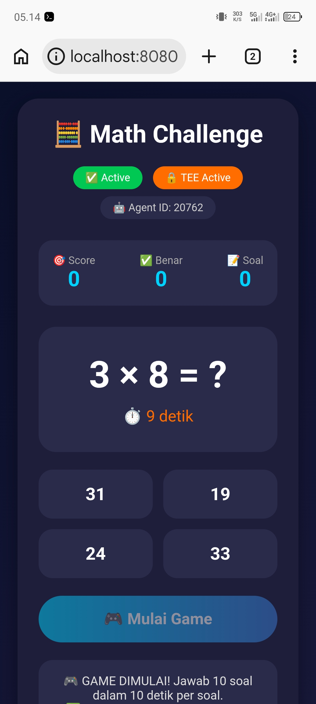

# 🧮 Math Challenge · Nova Core Game

> Game matematika interaktif yang terverifikasi oleh **Billions Network TEE**.  
> Setiap jawaban mendapat proof on-chain dari Nova Core Agent.

## 🎮 Fitur

| Fitur | Keterangan |
|-------|-------------|
| ➕ Operasi | Tambah, Kurang, Kali |
| ⏱️ Timer | 10 detik per soal |
| 🎯 Skor | +10 poin per jawaban benar |
| 🔒 TEE | Setiap jawaban dapat proof |

## 🤖 Agent Nova Core

| Komponen | Detail |
|----------|--------|
| **Agent ID** | `20762` |
| **Status** | ✅ Active · 🔒 TEE Active |
| **DID** | `did:iden3:billions:main:2VmAkXrihYaLnUvAzLdTPqEhHBpXymYKUDNQ2LcWsS` |

[🔗 Lihat di 8004scan](https://8004scan.io/agents/billions/20762)

## 🚀 Demo

Demo akan muncul setelah deploy ke Vercel.

---

*✅ Diverifikasi Nova Core (Billions TEE)*

